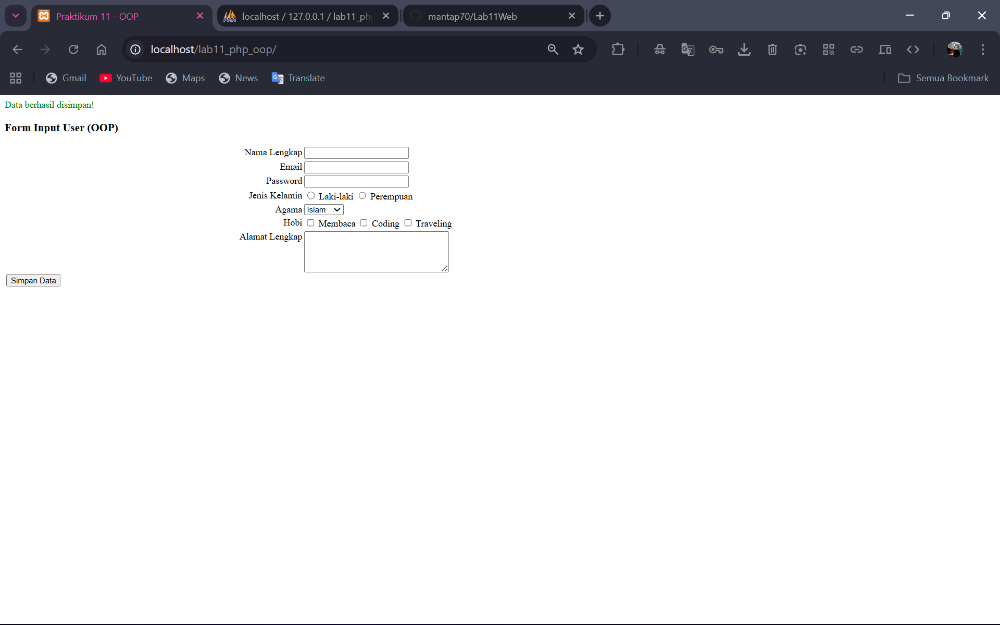
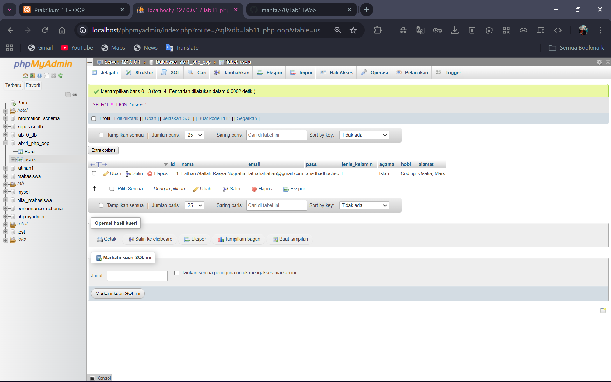

# Lab11Web
```
Nama:  Fathan Atallah Rasya Nugraha
NIM:   312410425
Kelas: TI.24.A3
```
<br>
<br>

## Tujuan Praktikum
1. Menerapkan konsep OOP pada PHP.
2. Memahami cara kerja modularisasi.
3. Menerapkan sistem routing sederhana menggunakan PHP.
4. Membuat form input dan menyimpan data ke database menggunakan OOP.

<br>
<br>

## Struktur folder project
```
lab11_php_oop/
 ├── .htaccess
 ├── config.php
 ├── index.php
 ├── class/
 │    ├── Database.php
 │    └── Form.php
 ├── module/
 │    └── home/
 │         └── index.php
 └── template/
      ├── header.php
      ├── footer.php
      └── sidebar.php

```
Keterangan:
- Folder class/ berisi library yang kita gunakan
- Folder module/ berisi halaman-halaman web
- Routing diarahkan ke folder module secara otomatis

<br>
<br>

## Konfigurasi database
Pada file config.php terdapat pengaturan:
```php
$config = [
  'host' => 'localhost',
  'username' => 'root',
  'password' => '',
  'db_name' => 'praktikum11'
];
```
Nama database harus sesuai dengan yang dibuat di phpMyAdmin. <br>
Kemudian membuat tabel:
```sql
CREATE TABLE users (
  id INT AUTO_INCREMENT PRIMARY KEY,
  nama VARCHAR(100),
  email VARCHAR(100),
  pass VARCHAR(100),
  jenis_kelamin VARCHAR(20),
  agama VARCHAR(50),
  hobi TEXT,
  alamat TEXT
);
```

<br>
<br>

## Routing
Routing berada pada file `index.php`
```php
$path = isset($_SERVER['PATH_INFO']) ? $_SERVER['PATH_INFO'] : '/home/index';
$segments = explode('/', trim($path, '/'));
$mod  = isset($segments[0]) ? $segments[0] : 'home';
$page = isset($segments[1]) ? $segments[1] : 'index';
$file = "module/{$mod}/{$page}.php";
```
Apabila module tidak ditemukan, sistem akan menampilkan pesan kesalahan.

<br>
<br>

## Proses input data
Form dibuat menggunakan class Form. <br>
Contoh penggunaan:
```php
$form = new Form("", "Simpan Data");
$form->addField("nama","Nama");
$form->addField("email","Email");
$form->displayForm();
```
Data dikirim dengan method POST lalu disimpan melalui class Database:
```php
$db->insert('users', $data);
```

<br>
<br>

## Hasil program - Form input user


## Hasil tabel database


<br>
<br>

# Tambahan


## Kesimpulan
Pada praktikum ini saya berhasil:
- Membuat struktur folder modular
- Mengimplementasikan sistem routing
- Membuat form dinamis menggunakan class
- Menghubungkan program ke database
- Menyimpan data form ke tabel mysql
- Framework sederhana ini memberikan wawasan bagaimana konsep MVC dan modular bisa diterapkan untuk project yang lebih besar.
